# MAIC_VOICE_AI_Challenge_2021

## 1. Overview
### 대회 개요.
- **목표 :** 음성 멜-스펙트럼 데이터를 이용한 음성 질환 진단 및 분류   
  - Task : 6-class classification
  Class : [ Normal, Cancer, Cyst_and_Polyp, Nodules, Functional_dysphonia, Paralysis ]
- **데이터 :** 음성 멜-스펙트로그램 데이터(csv)  
  - CSV파일은 2차원 배열이며, row(y)값은 128로 고정됨
  - column(x)값은 발화음성의 길이에 따라 달라짐. 
  - meta-data인 JSON 파일에는 각 음절 구간(x)의 시작 및 종료 값, 질환 분류가 기록됨.       
    - Train/Validation 데이터: 639건(명), Label 공개    
    - Test 데이터: 164건(명), Label 비공개
- **평가지표 :** Macro F1-score   
- **대회기간 :** 21.10.29 - 21.11.16
- **주최 :** 과학기술정보통신부, NIA 한국지능정보사회진흥원
- **주관 :** 서울대학교병원, EPI LAB
### 대회 성적
**rank :  1/43**.   
**score : 0.5759 (Macro F1-score)**

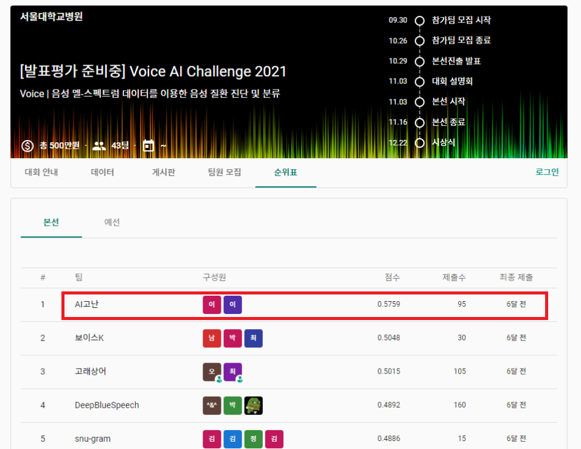

### 전체 프로세스 도식
- 학습모델 / 학습 방법 / 추론 방법
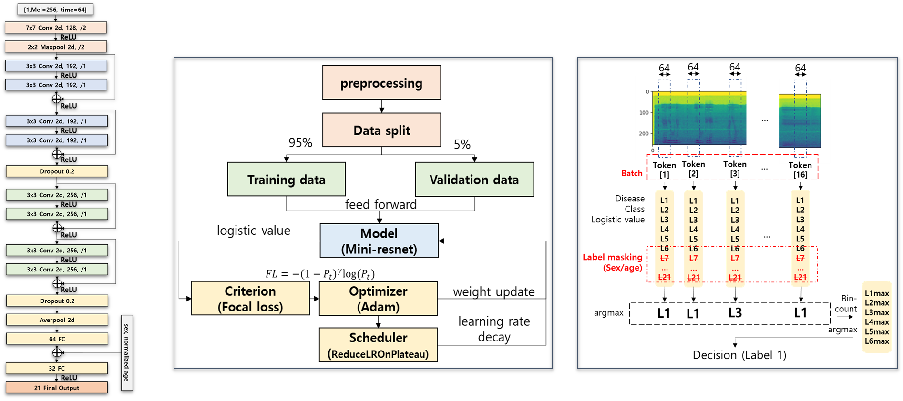
   
## 2. 팀빌딩
**- Leader : [thomas11809](https://github.com/thomas11809)** 
  - Ph.D. student at Seoul National University (SNU). /B.S. in Department of ECE, SNU.   
  - Role : data analysis, paper search, data processing, modeling, model test.   

    
**- Follower : [papari1123](https://github.com/papari1123)** 
  - M.S. in Department of Human ICT convergence in SKKU. / B.S. in Department of Information Display, KHU.
  - Role: paper search, modeling, model test, data processing support.

## 3. 개발환경
### 주요 패키지
#### 전처리
- librosa
- json
- PIL
- cv2
- numpys
- pandas
   
#### 모델 및 학습
- torch
- torchvision
    
#### 결과 정리
- matplotlib
    
## 4. 전처리 방법
### raw 데이터 분석
- small dataset
- class imbalance problem

  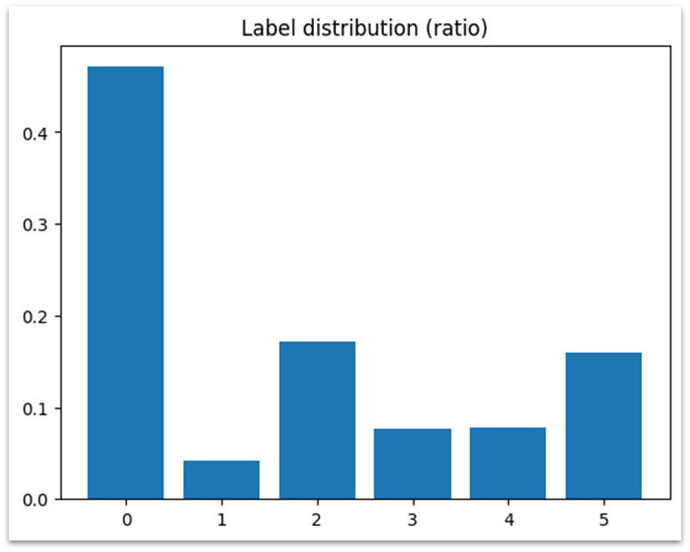

 |class|Normal|Cancer|Cyst & Polyp|Nodules| Functional dysphonia |Paralysis|  
 |:---:|:---:|:---:|:---:|:--------------------:|:---:|:---:|   
 |**sample**|301|27|110|49|          50          |102|   
 |**ratio**|47.1%|4.2%|17.2%|7.7%|         7.8%         |16.0%|     
   
   
- Meta-data 
  - 성별, 나이, 진단명
  
  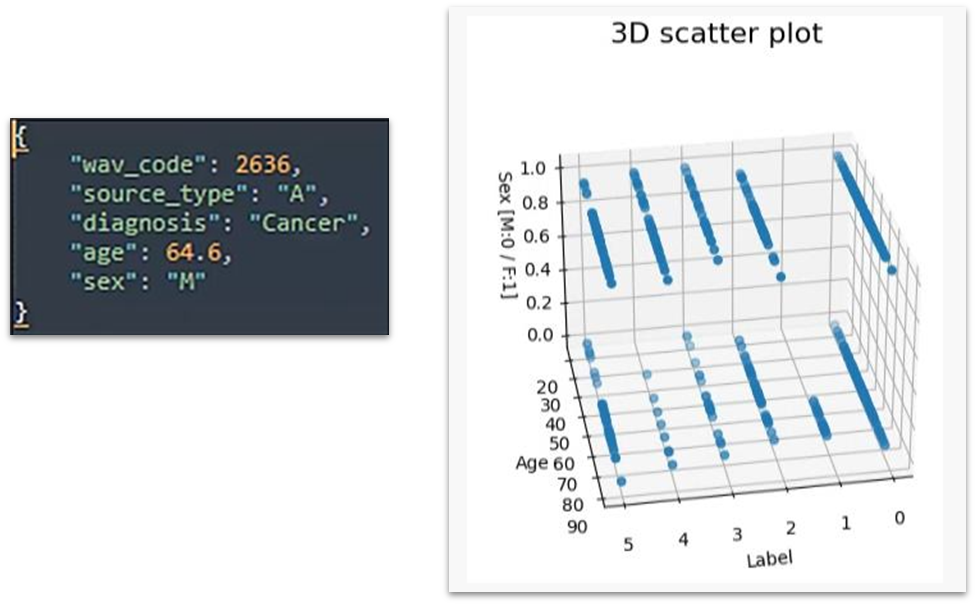

- Annotation data
  - 토큰 정보, 토큰 스킵 여부 / 발음 정확성 / 해당 구간 Frame 정보
  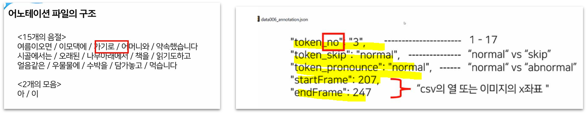   
      
- 분석에 따른 개선 방안   
  - 각 melspectrom을 토큰별로 나눠서 학습시킴.
  - Focal Loss를 도입해 학습 효율/성능을 높임.
  - 클래스를 더 분화하여 모델에게 학습.   
   
### 데이터 전처리
- 토큰 구간별 데이터 증강
: 기존 639개 -> 토큰 증가에 의해 10564개
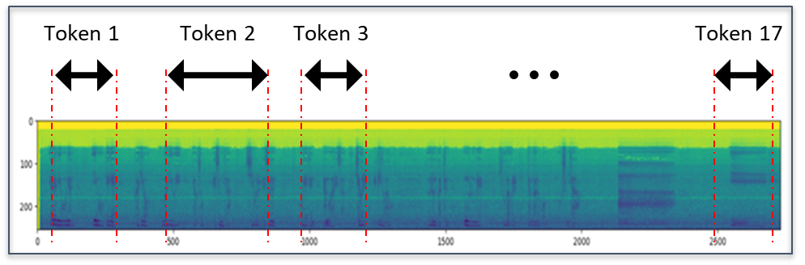  
     

- Class 세부 분화
: 성별/나이에 따라 기존 6개 -> 분화 후 21개     
  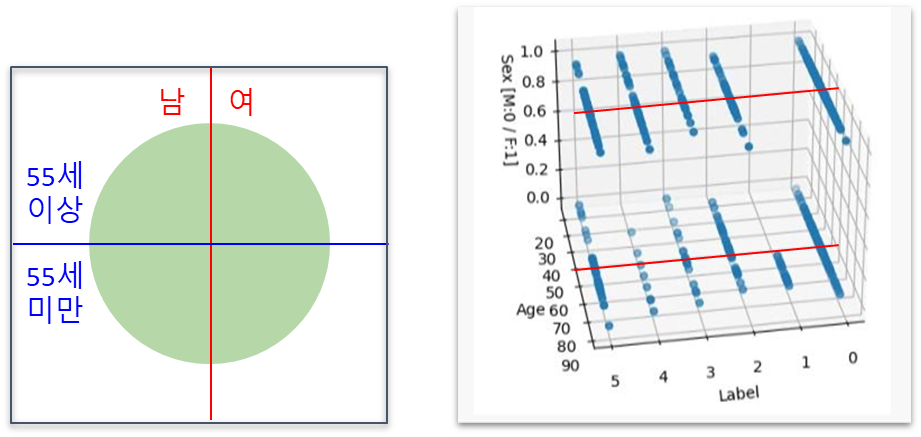
- Data Random Augmentation
  - input width 맞추기 위해, 길이 64 pixel 고정
  -길이가 64보다 작은 경우는 zero-padding
  - 길이가 64보다 큰 경우 랜덤으로 64인 구간 선택, 매 epoch마다 구간이 랜덤하게 선택되어 모델의 일반화 성능이 개선됨.
    
- Using Meta-data as Auxiliary input
  - 성별, 나이 데이터를 모델 입력으로 사용
     
## 5. 모델링
### 이론적 배경
- "mini-ResNet" : Robust CNN model as a backbone
  - 멜스펙트럼을 이용한 질병 예측(ResNet34 [1]) 또는 유사 분야인 감정 예측(AlexNet [2])에,
vision 분야에서 사용하는 CNN 기반 모델 사용
  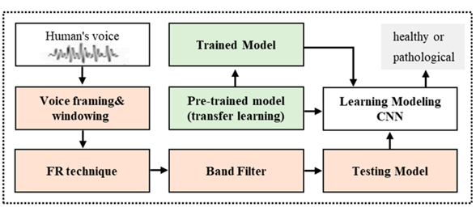 
  - 본 프로젝트에서는
  Backbone으로 자주 사용되는 ResNet을 차용하되, 
  학습 데이터 개수가 적기 때문에 overfitting을 방지하기 위해 복잡도(Complexity)가 낮은 경량화 모델 사용.
 
### 모델 구조
- Main input : [Batch, 1, mel=256, time=64]
- Auxiliary input: [Batch, sex, normalized age]	e.g., [32, 1, 0.4]
  - ResNet에서 사용하는 residual block를 사용    
    
 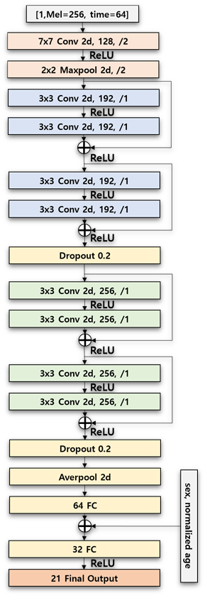

## 6. 학습 방법
### 학습전략
- Training, validation split
tokenizing을 통해 augmentation을 하더라도, 데이터의 personal pool이 한정되어
characteristic diversity는 기존과 동일.
- 따라서, 모델의 일반화 능력을 최대한 끌어올리기 위해 validation 비율은 5%(528 token)로 낮게 설정

  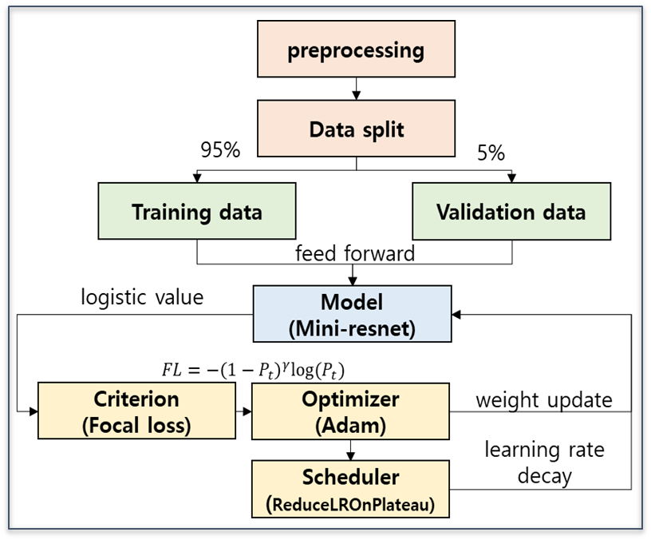
   

- Focal Loss 
  - 클래스 불균형 문제를 해결하기 위해, Retina [3]에서 제안된 Loss function
    - Easy negative에 대한 가중치는 줄임.
    - Hard negative에 대한 가중치는 키움.

  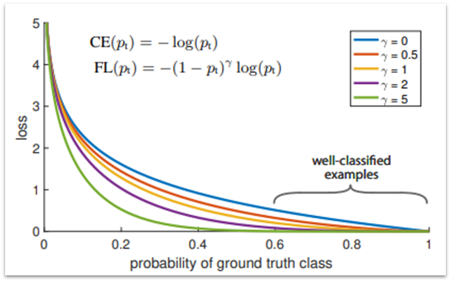

- Multi-Class Supervised Learning  
  - 지도 학습 데이터의 Class 수를 늘릴수를 분류 성능은 좋아짐. [4] 

### 하이퍼파라미터 튜닝
- Optimizer는 Adam Optimizer를 사용.
- Initial learning rate는 1e-3로 하되, scheduler로 ReduceLROnPlateau를 사용.

  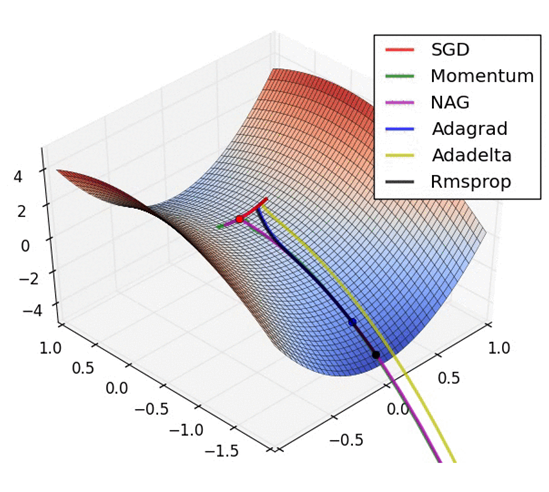

- CNN Kernel size는 Voice Pathology 예측 논문에 사용된 ResNet34 참고하여 유사하게 결정.   
- CNN channels size는 사용된 class 개수가  21개로 많은 편으로, 최소 128개 이상으로 하되
1.5배수씩 조정해가며 최적값 설정  
- FC input size는 Auxiliary input을 이어 붙였을때 적절한 mutual information loss를 가지는 하이퍼파라미터로 구성.

|parameter|                                Value                                 |
|:---:|:--------------------------------------------------------------------:|
|Learning rate|                                0.001                                 |
|Epoch|                              100 (max)                               |
|Batch size|                      32(training), 16(testing)                       |
|Optimizer|                                 Adam                                 |  
|Scheduler|        ReduceLROnPlateau  (lr decay rate = 0.3, patience = 5)         |
|CNN kernel size|                    first Conv = 7x7, other = 3x3                     |
 |CNN channels size| first Conv = 128,  1st residual block = 192,  2nd residual block = 256 |
|FC input size|                    first FC = 64, second FC = 32                     |

### 학습시간
- 대회에서 지원받은 GPU 기준으로 1 epoch 당 약 89 sec (training 88 sec, validation 1sec) 
- 학습 시 100 epoch = 100x89 = 8900 sec = 약 2시간 28분.

  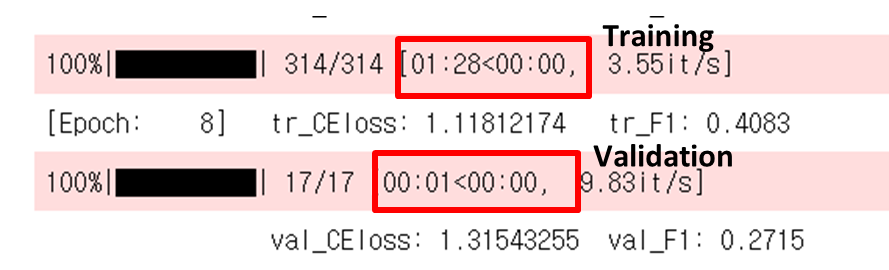

### 시도한 방법들
- General  [5]
  - time stretch (0.8, 1.2배),  gaussian noise 추가
  - 11073명 분의 오디오 데이터를 사용.
- SpecAugment [6]
  - speech masking (mel-frequency, time masking)
- 적용 결과
  - 학습성능 개선 효과가 없었음. 
  - 639명 분의 오디오 데이터를 학습에 사용해 personal characteristic diversity가 상대적으로 적음.
  - 학습 데이터가 더 다양하면 성능 개선이 클 것으로 사료됨.

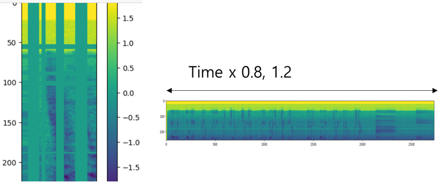

## 7. 추론 방법 및 결론
### 학습 결과
- 학습이 진행됨에 따라
  - Training CEloss는 0에 가까워짐
  - Macro F1 score는 1에 가까워짐
- 45 epoch 이후로
  - validation CEloss는 0.57 에서 수렴함
  - F1 score는 0.74 에서 수렴함
- Overfitting 방지를 위해
  - early stopping 방법 사용.
  - 추론은 47 epoch weight 사용

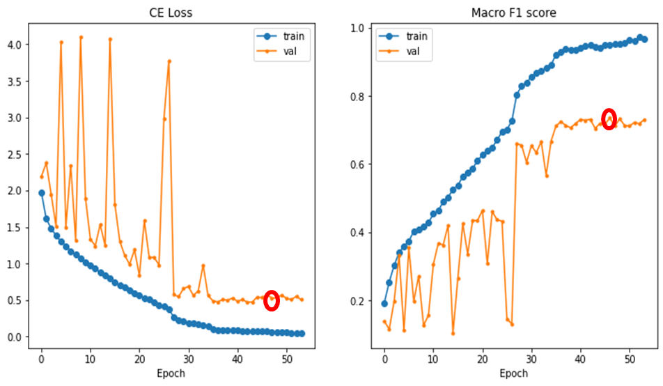

|47 epoch|Training|Vaildation|
|:---:|:---:|:---:|
|CEloss|0.0694|0.5732|
|F1 score|0.9478|0.7346|

### 추론 방법 
- 1 person = 1 batch = 16 token
  - 추론 과정에서는 환자 단위로 질병 예측
  - 각 token 별 maximum logit 값을 기준으로 가장 많이 voting된 클래스를 해당 환자의 질병 예측 결과로 함.
  - token 길이가 64보다 길 경우, token의 시작지점을 시드 기반 무작위 추출.
  
- Label masking (sex, age)
  - age, sex meta data를 활용해,
  결과로 나올 수 없는 클래스를 masking 함.
    - e.g., 55세 이상 남성의 경우 21개 클래스 중 L1~L6만 사용
    
    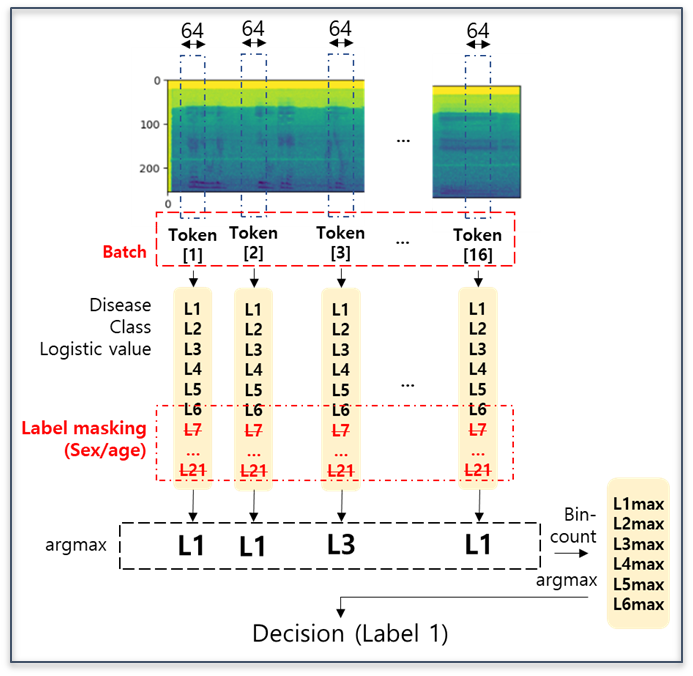

### 추론 결과 및 결론
- 최종 테스트 결과로 Micro-F1 score = 0.5759 의 정확도를 보임.
- 경량 CNN모델인 Mini-ResNet을  써도, 제안한 방법들을 통해 최고 성능을 낼 수 있었음.
  1. 토큰 구간별 데이터 증강 (tokenization) 
  2. 메타데이터 기반 Class 세부 분화 
  3. Focal Loss 사용 
  4. Label masking 
- 학습 데이터가 더 많으면, 사전 학습된 복잡도 큰 모델을 사용하여 
더 높은 정확도와 개선된 일반화 성능을 보일 것으로 사료됨.

## @. reference
- 모델링 - 이론적 배경
  - Resnet34 기반 voice pathology detection model
    - Mohammed MA, Abdulkareem KH, Mostafa SA, Khanapi Abd Ghani M, Maashi MS, Garcia-Zapirain B, Oleagordia I, Alhakami H, AL-Dhief FT. Voice Pathology Detection and Classification Using Convolutional Neural Network Model. Applied Sciences. 2020; 10(11):3723. https://doi.org/10.3390/app10113723
  - Alexnet기반 speech emotion recongition model
    - Zhang H, Gou R, Shang J, Shen F, Wu Y, Dai G. Pre-trained Deep Convolution Neural Network Model With Attention for Speech Emotion Recognition. Front Physiol. 2021;12:643202. Published 2021 Mar 2. doi:10.3389/fphys.2021.643202

- 모델링 - 모델구조
  - mini-resnet 모델 코드 (일부 사용)
    - https://deep-learning-study.tistory.com/534

- 학습방법 - 학습 전략
  - Focal Loss
    - TY Lin et al. Focal Loss for Dense Object Detection. Proceedings of the IEEE International Conference on Computer Vision (ICCV), 2017, pp.2980-2988; https://arxiv.org/pdf/1708.02002.pdf
  - Multi-Class Supervised-Learning
    - SJ Lee, NI Cho. A Study on the Performance Improvement of X-ray Foreign Matter Classification Neural Networks Using Multi-scale CAM. Proceedings of the Korean Society of Broadcast Engineers Conference. 2021; https://www.koreascience.or.kr/article/CFKO202130759684597.page

- 학습방법 - 하이퍼파라미터 튜닝
  - Plateau 그림 출처
    - https://velog.io/@minjung-s/Optimization-Algorithm
  - Information Bottleneck 그림 출처
    - https://stopspoon.tistory.com/57
- 학습방법 - 시도한 방법
  - augmentation method review
    - ei, Shengyun & Zou, Shun & Liao, Feifan & Lang, Weimin. (2020). A Comparison on Data Augmentation Methods Based on Deep Learning for Audio Classification. Journal of Physics: Conference Series. 1453. 012085. 10.1088/1742-6596/1453/1/012085. 
  - spec-augment
    - Park, D. S., Chan, W., Zhang, Y., Chiu, C. C., Zoph, B., Cubuk, E. D., & Le, Q. V. (2019) Specaugment: A simple data augmentation method for automatic speech recognition.arXiv preprint arXiv:1904.08779.
